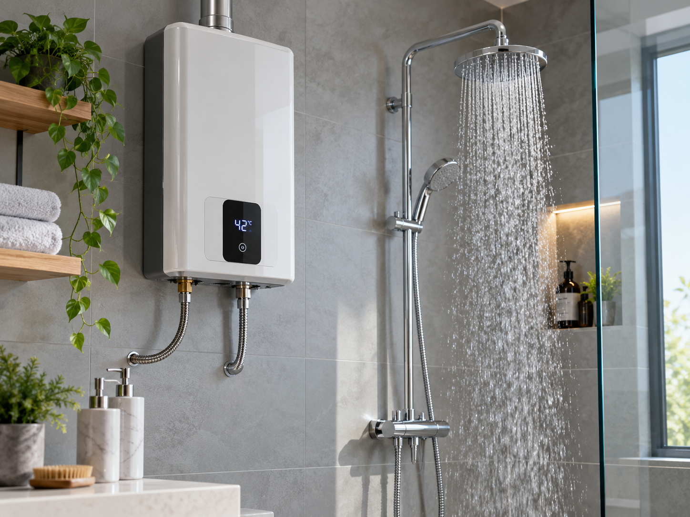
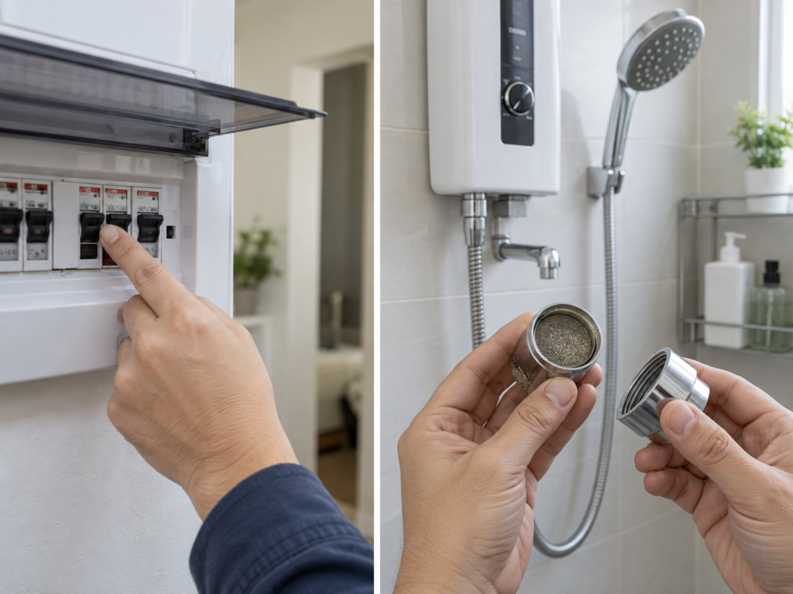
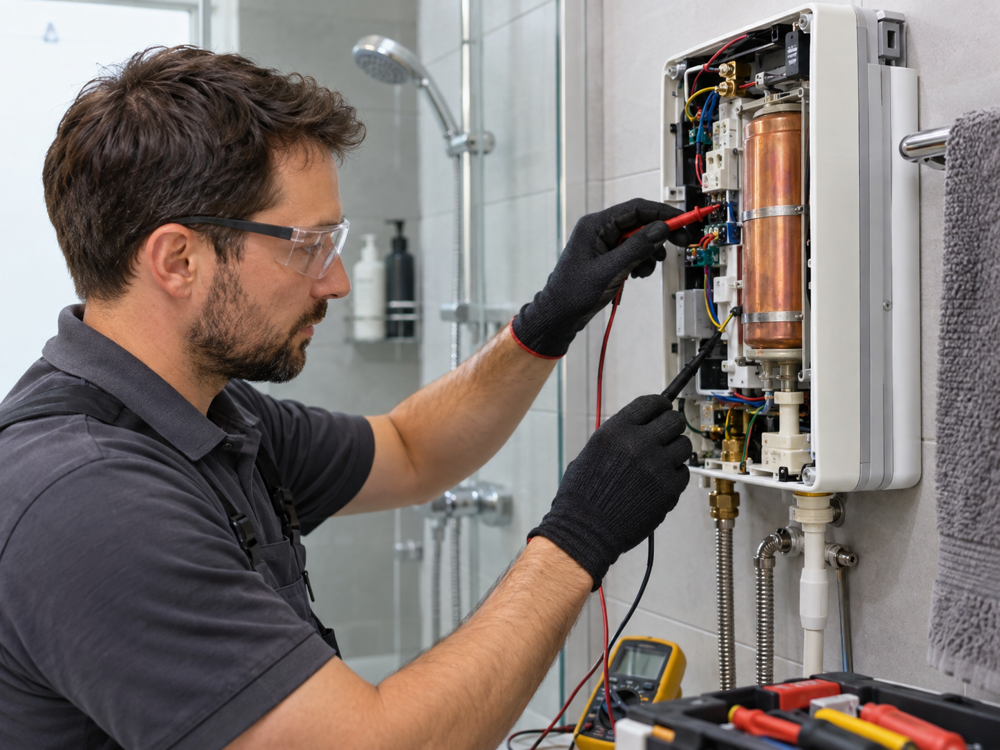

# صيانة كلاج: كيف تكتشف أعطال سخان المياه الفوري قبل توقفه؟

تساعد **صيانة كلاج** الدورية على الحفاظ على كفاءة سخان المياه الكهربائي الفوري، لكنها لا تعني انتظار توقف الجهاز تمامًا ثم البحث عن سبب المشكلة. ففي كثير من الحالات يسبق العطل الكامل عدد من العلامات الواضحة، مثل ضعف التسخين، أو تغير درجة حرارة المياه أثناء الاستخدام، أو تراجع معدل التدفق.

الانتباه إلى هذه المؤشرات مبكرًا قد يساعد على تحديد ما إذا كانت المشكلة مرتبطة بمصدر الكهرباء، أو تدفق المياه، أو الترسبات، أو بأحد المكونات الداخلية التي تحتاج إلى فحص فني متخصص. كما أن فهم طريقة عمل السخان الفوري يجعل تشخيص المشكلة أكثر دقة ويقلل من محاولات الإصلاح العشوائية.

## أشهر أعطال سخانات كلاج التي يمكن ملاحظتها

تختلف أعطال سخان المياه الفوري حسب ظروف التشغيل وطبيعة المشكلة، لكن هناك مجموعة من الأعراض المتكررة التي يمكن للمستخدم ملاحظتها بسهولة، ومنها:

- السخان لا يعمل عند فتح المياه.
- المياه تخرج دافئة ولكنها لا تصل إلى درجة الحرارة المطلوبة.
- درجة حرارة المياه ترتفع وتنخفض أثناء الاستخدام.
- انخفاض كمية المياه الساخنة مقارنة بالمعتاد.
- ظهور صوت غير طبيعي أثناء تشغيل السخان.
- توقف التسخين ثم عودته بصورة متقطعة.
- تأخر استجابة السخان بعد فتح الصنبور.

ولا تعني هذه الأعراض بالضرورة أن عنصر التسخين نفسه تالف. فقد يكون السبب أبسط من ذلك، مثل ضعف ضغط المياه أو انسداد أحد الفلاتر.

ولهذا من المفيد الرجوع إلى معلومات منظمة حول [إرشادات صيانة كلاج](https://clage.repair/) لفهم طبيعة السخان والمشكلات المرتبطة بالتشغيل والتدفق قبل الانتقال إلى فحص المكونات الداخلية.

## علامات تشير إلى أن السخان يحتاج إلى الفحص

هناك فارق بين العطل المفاجئ وبين التراجع التدريجي في الأداء، والثاني أكثر شيوعًا مما قد يبدو.

### تراجع كفاءة التسخين

إذا احتاج السخان إلى وقت أطول للحصول على درجة الحرارة المعتادة، أو أصبحت المياه أقل حرارة رغم استخدام الإعدادات نفسها، فقد تكون هناك مشكلة تحتاج إلى الفحص.

### تغير الحرارة أثناء الاستخدام

التغير المستمر بين المياه الساخنة والأقل حرارة قد يرتبط بتذبذب تدفق المياه، أو ضغط الشبكة، أو عمل مستشعرات الحرارة.

### انخفاض معدل المياه

في بعض الحالات تكون المشكلة في مسار المياه نفسه وليس في الدائرة الكهربائية، وخاصة عند وجود فلاتر أو رؤوس دش تحتوي على ترسبات.

## ما أسباب ضعف تسخين المياه؟

ضعف التسخين من أكثر المشكلات التي يواجهها مستخدمو سخانات المياه الفورية، لكن تشخيصه يحتاج إلى النظر إلى أكثر من عامل.

من الأسباب المحتملة ارتفاع معدل تدفق المياه بصورة تفوق قدرة السخان على رفع حرارتها بالدرجة المطلوبة. فكلما مرت كمية أكبر من المياه خلال فترة قصيرة، أصبح على السخان توفير طاقة أكبر لتسخينها.

وقد يكون السبب أيضًا انخفاض القدرة الكهربائية الواصلة إلى الجهاز، أو مشكلة في أحد عناصر التسخين، أو خلل في مستشعر الحرارة المسؤول عن مراقبة درجة المياه.

كما يمكن أن تتسبب الترسبات الكلسية في تقليل كفاءة انتقال الحرارة أو التأثير في بعض مسارات المياه الداخلية، خصوصًا في المناطق التي تحتوي مياهها على نسبة مرتفعة من الأملاح.

## لماذا يجب فحص ضغط وتدفق المياه؟

تعتمد سخانات المياه الفورية على تسخين المياه أثناء مرورها داخل الجهاز، ولذلك توجد علاقة مباشرة بين **معدل التدفق وقدرة السخان على رفع درجة الحرارة**.

عندما يكون التدفق مرتفعًا جدًا، تقضي المياه فترة أقل داخل منطقة التسخين، وبالتالي قد تخرج بدرجة حرارة أقل.

أما إذا كان التدفق منخفضًا بصورة غير طبيعية، فقد تكون هناك مشكلة في ضغط المياه أو انسداد في الفلتر أو رأس الدش أو أحد أجزاء شبكة المياه.

لهذا قد يبدو أحيانًا أن السخان يعاني من مشكلة كهربائية بينما يكون السبب الحقيقي متعلقًا بالمياه.

## تأثير الترسبات الكلسية في أداء السخان

تحتوي المياه بدرجات متفاوتة على معادن وأملاح يمكن أن تترسب بمرور الوقت.

وقد تؤدي هذه الترسبات إلى تضييق بعض مسارات المياه أو تقليل كفاءة نقل الحرارة، كما يمكن أن تتراكم على الفلاتر أو نقاط مرور المياه.

ومع استمرار المشكلة قد يلاحظ المستخدم انخفاض معدل التدفق أو تغيرًا في درجة الحرارة أو زيادة الحاجة إلى ضبط السخان على مستوى أعلى للحصول على الحرارة نفسها.

لذلك يعد التعامل المبكر مع الترسبات جزءًا مهمًا من **صيانة كلاج** والحفاظ على استقرار أداء السخان.

## متى يمكن إجراء فحص بسيط بنفسك؟

هناك بعض الخطوات الخارجية التي يمكن للمستخدم تنفيذها دون فتح الجهاز، مثل:

- التأكد من وصول الكهرباء إلى المنزل والسخان.
- فحص وضع قاطع الكهرباء الخاص بالجهاز.
- التأكد من أن مصدر المياه مفتوح بصورة طبيعية.
- ملاحظة قوة تدفق المياه من الصنبور.
- فحص رأس الدش بحثًا عن انسداد واضح.
- تنظيف الفلاتر الخارجية القابلة للتنظيف وفق تعليمات الجهاز.

لكن يجب التوقف عند هذا الحد إذا كان الفحص يتطلب فتح غطاء السخان أو التعامل مع الأسلاك أو الأجزاء الكهربائية الداخلية.

## متى يحتاج السخان إلى فني متخصص؟

ينبغي الاستعانة بمختص عندما تشير المشكلة إلى أحد عناصر التسخين، أو المستشعرات، أو لوحة التحكم، أو التوصيلات الكهربائية الداخلية.

وينطبق الأمر نفسه عند وجود تسريب داخل الجهاز، أو رائحة غير طبيعية، أو فصل متكرر لقاطع الكهرباء.

محاولة إصلاح هذه الأعطال دون معرفة فنية مناسبة قد تؤدي إلى تلف إضافي أو خطر كهربائي، لذلك يجب فصل مصدر الطاقة وعدم العبث بالأجزاء الداخلية.

## كيف تحافظ على كفاءة سخان المياه الفوري؟

يمكن تقليل كثير من المشكلات من خلال ملاحظة أداء السخان بصورة منتظمة. فإذا تغيرت درجة حرارة المياه بصورة مفاجئة، أو انخفض التدفق، فمن الأفضل البحث عن السبب بدلًا من تجاهله لفترات طويلة.

يساعد تنظيف الفلاتر عند الحاجة، ومتابعة الترسبات، وفحص التوصيلات الكهربائية دوريًا بواسطة مختص في تقليل احتمالات الأعطال المفاجئة.

كما يجب استخدام السخان ضمن متطلبات التشغيل والطاقة والتدفق المحددة من الشركة المصنعة، وعدم تجاهل أي تغيير متكرر في الأداء.

يمكن كذلك الرجوع إلى [إرشادات التشغيل والصيانة الدورية لمعدات المياه](https://www.energy.gov/cmei/femp/technical-operations-and-maintenance-guidelines-common-water-equipment) للاطلاع على مبادئ عامة تتعلق بالفحص المنتظم، والصيانة الوقائية، والتعامل المبكر مع المشكلات.

## الخاتمة

لا تعتمد **صيانة كلاج** فقط على إصلاح السخان بعد توقفه، بل تبدأ من مراقبة الأداء اليومي وفهم التغيرات التي تحدث في درجة حرارة المياه ومعدل التدفق.

فقد يكون ضعف التسخين مرتبطًا بضغط المياه أو الترسبات، بينما تحتاج المشكلات المتعلقة بعناصر التسخين أو الحساسات أو لوحة التحكم إلى تدخل متخصص.

ومع الفحص المبكر، وتنظيف الأجزاء الخارجية المسموح بالتعامل معها، والانتباه لأي تغير غير معتاد في أداء السخان، يمكن الحفاظ على كفاءة التشغيل وتقليل فرص حدوث الأعطال المفاجئة.
