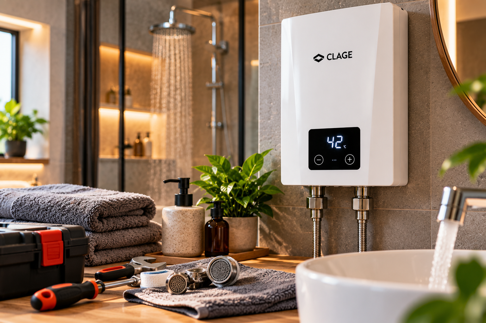
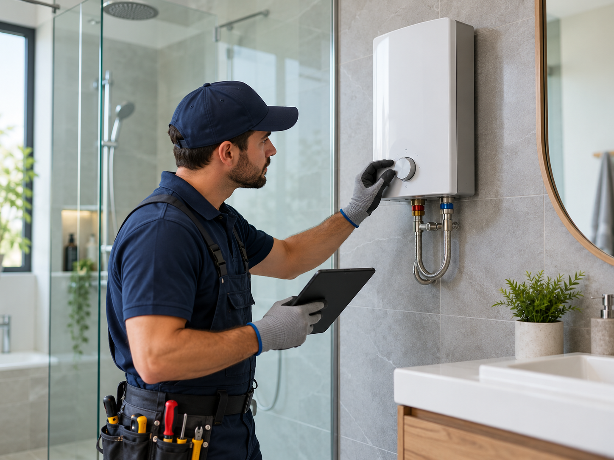
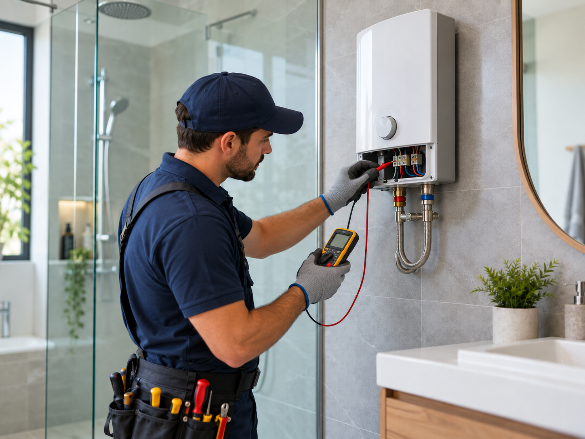

# صيانة سخانات كلاج: كيف تكتشف أسباب ضعف أداء سخان المياه الفوري قبل تفاقم العطل؟

تعتمد سخانات المياه الكهربائية الفورية على تسخين المياه أثناء مرورها داخل الجهاز، ولذلك فإن استقرار الأداء يرتبط بعدة عوامل، من أهمها ضغط المياه، ومعدل التدفق، والتغذية الكهربائية، وحالة عناصر التسخين والحساسات.

ولهذا لا تقتصر **صيانة سخانات كلاج** على التعامل مع العطل بعد توقف الجهاز، بل تشمل أيضًا ملاحظة التغيرات المبكرة في الأداء، والتي قد تساعد على اكتشاف المشكلة قبل أن تتطور وتؤثر على كفاءة السخان أو استقرار درجة حرارة المياه.

عند ملاحظة ضعف التسخين أو تغير درجة الحرارة، لا يُفضل افتراض تلف عنصر التسخين مباشرة، فقد يكون السبب أبسط من ذلك، مثل انخفاض ضغط المياه أو تغير معدل التدفق أو تراكم الرواسب في أحد المخارج.

وللتعرف بصورة أكبر على الخدمات المرتبطة بالفحص والتشخيص والإصلاح، يمكن الاطلاع على [خدمات صيانة سخانات كلاج وفحص الأعطال](https://clage.repair/%D8%AE%D8%AF%D9%85%D8%A7%D8%AA%D9%86%D8%A7/).

## علامات مبكرة تشير إلى حاجة سخان كلاج للفحص

نادراً ما يتوقف السخان بصورة كاملة دون ظهور بعض العلامات السابقة التي تشير إلى وجود تغير في الأداء.

ومن أبرز العلامات التي تستحق الانتباه:

- انخفاض درجة حرارة المياه عن المستوى المعتاد.
- تغير الحرارة بين الساخن والبارد أثناء الاستخدام.
- ضعف تدفق المياه الساخنة.
- فصل السخان بصورة متكررة أثناء التشغيل.
- عدم الوصول إلى درجة الحرارة المطلوبة.
- ظهور صوت غير معتاد أثناء تشغيل الجهاز.
- اختلاف أداء السخان عند تشغيل أكثر من نقطة مياه في الوقت نفسه.

ولا تعني هذه الأعراض بالضرورة وجود عطل كهربائي داخلي، لكنها تساعد على تضييق نطاق الأسباب المحتملة قبل البدء في أعمال الصيانة.

## لماذا يصبح الماء أقل سخونة؟

### معدل تدفق المياه

توجد علاقة مباشرة بين كمية المياه التي تمر داخل السخان وبين مقدار الحرارة التي يستطيع الجهاز إضافتها إليها.

فعندما يكون معدل تدفق المياه مرتفعًا مقارنة بقدرة السخان، قد تخرج المياه بدرجة حرارة أقل من المطلوبة.

وفي المقابل، قد يؤدي ضعف التدفق أو عدم استقراره إلى تغير سلوك بعض السخانات التي تعتمد على حساس تدفق لتحديد وقت تشغيل عناصر التسخين.

لذلك من المفيد تجربة المياه من أكثر من صنبور لمعرفة ما إذا كانت المشكلة عامة في شبكة المياه أم مرتبطة بنقطة استخدام محددة.

### التغذية الكهربائية وعناصر التسخين

يعتمد سخان المياه الفوري على قدرة كهربائية مناسبة للوصول إلى درجة الحرارة المطلوبة خلال فترة قصيرة.

وفي حالة وجود مشكلة في التغذية الكهربائية أو أحد عناصر التسخين، قد تظهر أعراض مثل:

- ضعف مستمر في التسخين.
- عدم الوصول إلى درجة الحرارة المختارة.
- توقف الجهاز بصورة متقطعة.
- فصل القاطع الكهربائي أثناء التشغيل.

ويجب تجنب فتح السخان أو محاولة اختبار المكونات الكهربائية الداخلية دون خبرة، لأن سخانات المياه الفورية تعمل بقدرات كهربائية مرتفعة وتتطلب إجراءات سلامة وأدوات قياس مناسبة.

## تأثير الترسبات الكلسية على أداء السخان

تحتوي المياه بصورة طبيعية على نسبة من المعادن تختلف من منطقة إلى أخرى، ومع الاستخدام المستمر قد تتراكم الرواسب في رؤوس الدش أو مخارج المياه وبعض أجزاء مسار المياه.

وقد تؤدي هذه الترسبات إلى:

- تقليل معدل تدفق المياه.
- عدم استقرار التدفق.
- اختلاف درجة حرارة المياه.
- انخفاض كفاءة التشغيل تدريجيًا.
- انسداد بعض مخارج المياه.

لذلك يعد تنظيف مخارج المياه ومراقبة تراكم الرواسب جزءًا مهمًا من **الصيانة الوقائية لسخانات كلاج**، خصوصًا في المناطق التي تتكون فيها الترسبات بسرعة.

## فحص بسيط يمكن القيام به قبل طلب الصيانة

قبل الاستعانة بفني، يمكن إجراء مجموعة من الفحوصات الخارجية البسيطة التي لا تتطلب فك الجهاز أو لمس مكوناته الداخلية.

يمكن التأكد من:

- أن مصدر الكهرباء يعمل بصورة طبيعية.
- عدم وجود قاطع كهربائي مفصول.
- أن إعداد درجة الحرارة لم يتغير عن طريق الخطأ.
- عدم وجود انسداد ظاهر في رأس الدش.
- عدم تراكم كمية كبيرة من الرواسب في مخرج المياه.
- تجربة المياه من أكثر من صنبور.
- ملاحظة ما إذا كانت المشكلة تحدث باستمرار أم فقط عند استخدام أكثر من نقطة مياه.

تساعد هذه الملاحظات في وصف المشكلة بصورة أدق عند طلب الصيانة، كما تساعد الفني على التفرقة بين مشكلات تدفق المياه والأعطال الداخلية في السخان.

## متى تحتاج صيانة سخانات كلاج إلى فني متخصص؟

هناك بعض الحالات التي لا يُنصح بالتعامل معها كإجراء منزلي بسيط، خاصة إذا كانت مرتبطة بالكهرباء أو بالمكونات الداخلية للسخان.

يفضل طلب فحص متخصص عند ملاحظة:

- رائحة احتراق.
- سخونة غير طبيعية.
- فصل القاطع الكهربائي بصورة متكررة.
- تسريب مياه بالقرب من التوصيلات الكهربائية.
- توقف السخان تمامًا رغم وجود الكهرباء والمياه.
- استمرار ضعف التسخين بعد مراجعة الإعدادات والتدفق.
- الاشتباه في وجود مشكلة بحساس الحرارة أو حساس التدفق.
- الاشتباه في تلف أحد عناصر التسخين.

التشخيص الصحيح يعتمد على إجراء قياسات واختبارات للمكونات، وليس على استبدال قطع الغيار بصورة عشوائية.

## لماذا التشخيص الصحيح مهم قبل استبدال قطع السخان؟

من الأخطاء الشائعة افتراض أن ضعف التسخين يعني بالضرورة تلف عنصر التسخين.

لكن التشخيص الأفضل يبدأ بالأسباب الأبسط أولًا، مثل:

1. فحص تدفق المياه.
2. التأكد من ضغط المياه.
3. مراجعة إعداد درجة الحرارة.
4. التأكد من عدم وجود انسداد في المخارج.
5. فحص التغذية الكهربائية عند الحاجة.
6. اختبار الحساسات والمكونات الداخلية بواسطة فني مؤهل.

هذا الأسلوب يساعد على الوصول إلى السبب الحقيقي للمشكلة ويقلل احتمالات استبدال أجزاء سليمة دون داعٍ.

## كيف تحافظ على استقرار أداء سخان كلاج؟

المتابعة الدورية تساعد على اكتشاف المشكلات في مرحلة مبكرة.

ومن الإجراءات المفيدة:

- تنظيف رؤوس الدش ومخارج المياه بصورة منتظمة.
- مراقبة ضغط وتدفق المياه.
- متابعة استقرار درجة الحرارة أثناء التشغيل.
- عدم تجاهل التوقف المتكرر للسخان.
- التعامل مع أي تسريب مياه فور ظهوره.
- عدم فتح الدوائر الكهربائية الداخلية دون متخصص.
- فحص السخان عند ملاحظة تغير مستمر في أدائه.

كما أن معرفة طبيعة المياه المستخدمة ومعدل تكوّن الترسبات تساعد على تحديد الحاجة إلى التنظيف والصيانة بصورة أكثر انتظامًا.

## الخلاصة

تبدأ **صيانة سخانات كلاج** الجيدة من مراقبة أداء الجهاز والانتباه إلى أي تغير في درجة حرارة المياه أو معدل التدفق أو طريقة تشغيل السخان.

ضعف التسخين لا يعني دائمًا وجود عطل كبير، فقد تكون المشكلة مرتبطة بضغط المياه أو معدل التدفق أو تراكم الرواسب أو انسداد أحد المخارج.

أما الأعطال المتعلقة بعناصر التسخين والحساسات والتوصيلات الكهربائية، فيفضل أن يتم فحصها بواسطة فني مؤهل.

ويساعد الجمع بين المراقبة الدورية والتشخيص الصحيح والصيانة المناسبة على الحفاظ على كفاءة سخان المياه الفوري وتقليل احتمالات الأعطال والتوقف المفاجئ.
